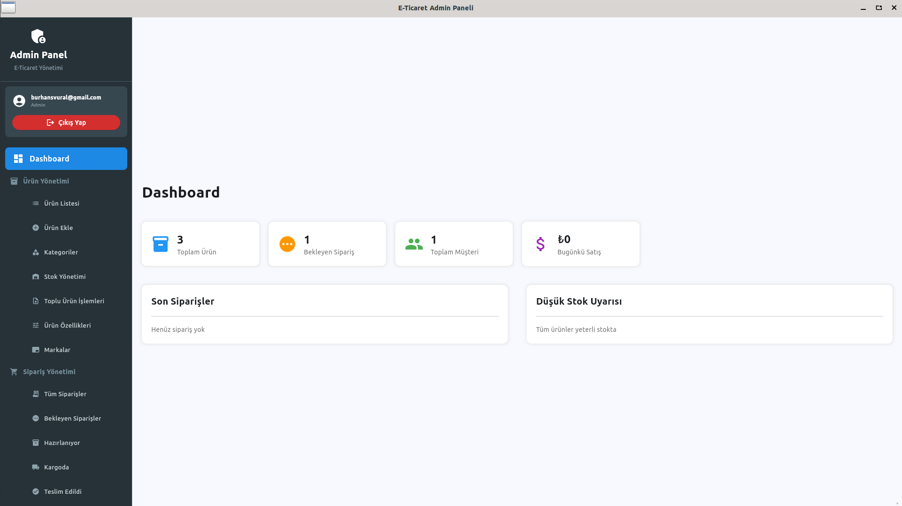

# E-Ticaret Projesi



Bu proje, Python tabanlı modern bir e-ticaret uygulamasıdır. FastAPI ile RESTful API backend'i, Flet ile masaüstü frontend ve admin paneli içerir. Proje, ürün yönetimi, kullanıcı kaydı, sipariş oluşturma ve gerçek zamanlı güncellemeler gibi temel e-ticaret özelliklerini sunar.

## Proje Amacı

Bu e-ticaret projesi, öğrencilerin modern web teknolojileri ve API geliştirme konularında pratik yapabilmeleri için tasarlanmıştır. Proje şu ana özellikleri içerir:

- **Ürün Yönetimi**: Ürün ekleme, düzenleme, silme ve listeleme
- **Kullanıcı Sistemi**: Kullanıcı kaydı, giriş ve yönetimi
- **E-mail Doğrulama Sistemi**: Güvenli kayıt için e-mail doğrulama
- **Müşteri Kayıt Sistemi**: Kapsamlı kullanıcı kayıt formu (ad, soyad, telefon, adres)
- **Kimlik Doğrulama**: Kullanıcı giriş/çıkış sistemi
- **Sipariş Sistemi**: Sepet yönetimi ve sipariş oluşturma
- **Gerçek Zamanlı Güncellemeler**: WebSocket ile anlık bildirimler
- **Resim Yükleme**: Ürün resimleri için dosya yükleme sistemi
- **Admin Paneli**: Ürün, sipariş ve müşteri yönetimi için ayrı arayüz
- **Müşteri Yönetimi**: Admin panelinde müşteri listesi ve yönetim araçları

## Proje Dizin Yapısı

```
e_ticaret_projesi/
├── backend/                          # FastAPI Backend Servisi
│   ├── __init__.py                   # Python paketi tanımı
│   ├── main.py                       # Ana FastAPI uygulaması ve API endpoint'leri
│   ├── models.py                     # SQLAlchemy veritabanı modelleri (Product, User, Order, OrderItem)
│   ├── schemas.py                    # Pydantic veri doğrulama şemaları
│   ├── database.py                   # Veritabanı bağlantı yapılandırması
│   ├── email_service.py              # E-mail doğrulama servisi
│   └── templates/                    # E-mail şablonları
│       └── email_verification.html   # E-mail doğrulama şablonu
│
├── frontend/                         # Flet Desktop Frontend Uygulaması
│   ├── __init__.py                   # Python paketi tanımı
│   ├── main.py                       # Frontend uygulaması giriş noktası
│   ├── main2.py                      # Alternatif frontend versiyonu
│   ├── src/                          # Frontend kaynak kodları
│   │   ├── __init__.py              # Python paketi tanımı
│   │   ├── app.py                   # Ana uygulama sınıfı ve rota yönetimi
│   │   ├── api.py                   # Backend API ile iletişim fonksiyonları
│   │   ├── components/              # Yeniden kullanılabilir UI bileşenleri
│   │   │   ├── __init__.py         # Python paketi tanımı
│   │   │   └── product_card.py     # Ürün kartı bileşeni
│   │   └── views/                   # Sayfa görünümleri
│   │       ├── __init__.py         # Python paketi tanımı
│   │       ├── main_view.py        # Ana sayfa görünümü
│   │       ├── cart_view.py        # Sepet sayfası görünümü
│   │       ├── signup_view.py      # Kullanıcı kayıt sayfası görünümü
│   │       ├── auth_view.py        # Giriş/Kayıt sayfası görünümü
│   │       └── email_verification_view.py  # E-mail doğrulama sayfası
│   └── storage/                     # Frontend veri depolama
│       └── data/                    # Yerel veri dosyaları
│
├── admin_panel/                      # Flet Desktop Admin Paneli
│   ├── main.py                       # Admin paneli ana uygulaması
│   ├── main2.py                      # Alternatif admin paneli versiyonu
│   └── storage/                      # Admin paneli veri depolama
│       └── data/                     # Yerel admin veri dosyaları
│
├── static/                           # Statik dosyalar (yüklenen resimler)
│
├── requirements.txt                  # Python bağımlılıkları
├── CHANGELOG.md                      # Sürüm değişiklikleri
├── TODO_LIST.md                      # Gelecek geliştirmeler
└── README.md                         # Proje dokümantasyonu
```

## Teknoloji Yığını

- **Backend**: FastAPI, SQLAlchemy, Pydantic, WebSocket
- **Frontend**: Flet (Flutter for Python)
- **Veritabanı**: SQLite (geliştirme için)
- **HTTP İstemcisi**: Requests
- **E-mail Servisi**: FastAPI-Mail, Jinja2, SMTP
- **Güvenlik**: JWT (PyJWT), Bcrypt, Passlib, Redis (Rate Limiting)
- **Dosya Yükleme**: Multipart form data
- **Rate Limiting**: SlowAPI (Redis-backed)
- **Session Management**: SQLAlchemy ORM
- **Token Blacklisting**: JWT ID (JTI) based

## Kurulum ve Çalıştırma

### Gereksinimler
```bash
pip install -r requirements.txt
```

Veya manuel kurulum:
```bash
pip install fastapi uvicorn sqlalchemy flet requests fastapi-mail jinja2 python-jose bcrypt passlib aiosqlite
```

### Server Çalıştırma
```bash
uvicorn backend.main:app --reload
```
Backend servisi http://127.0.0.1:8000 adresinde çalışacaktır.

### Admin Panel Çalıştırma
```bash
python admin_panel/main.py
```
Ürün ekleme, düzenleme, silme işlemleri için admin arayüzü.

### Frontend Çalıştırma
```bash
python frontend/main.py
```
Müşteri tarafı masaüstü uygulaması.

## API Endpoints

### Ürün Yönetimi
- `GET /products/` - Tüm ürünleri listele
- `POST /products/` - Yeni ürün ekle
- `GET /products/{id}` - Belirli ürünü getir
- `PUT /products/{id}` - Ürünü güncelle
- `DELETE /products/{id}` - Ürünü sil

### Kullanıcı Yönetimi
- `POST /users/register` - Yeni kullanıcı kaydı (ad, soyad, email, telefon, adres, şifre)
- `POST /users/login` - Kullanıcı girişi (email, şifre) - E-mail doğrulama kontrolü
- `POST /users/refresh-token` - JWT token yenileme
- `POST /users/logout` - Güvenli çıkış (token blacklisting)
- `GET /users/` - Kullanıcı listesi (Admin yetkisi gerekli)
- `POST /users/` - Yeni kullanıcı kaydet (Eski endpoint - geriye uyumluluk)

### E-mail Doğrulama
- `POST /users/verify-email` - E-mail doğrulama token'ı ile hesap aktifleştirme
- `POST /users/resend-verification` - Doğrulama e-mailini yeniden gönderme

### Sipariş Yönetimi
- `POST /orders/` - Yeni sipariş oluştur
- `GET /orders/` - Siparişleri listele

### Dosya Yönetimi
- `POST /upload-image/` - Güvenli resim yükleme (Magic bytes validation)

### Admin Güvenlik Endpoint'leri
- `POST /admin/revoke-user-tokens/{user_id}` - Kullanıcının tüm token'larını iptal et
- `POST /admin/cleanup-blacklist` - Süresi dolmuş blacklist token'larını temizle

### WebSocket
- `WS /ws/products_updates` - Gerçek zamanlı güncellemeler

## Yeni Özellikler (v2.3.0 - 30 Eylül 2025)

### 🔒 Enterprise Seviye Güvenlik Sistemi

#### JWT Token Blacklisting Sistemi
- **Anında Token İptali**: Çıkış yapıldığında token'lar anında geçersiz hale gelir
- **JWT ID (JTI) Tracking**: Her token'a benzersiz ID atanarak takip edilir
- **Database Blacklisting**: İptal edilen token'lar veritabanında saklanır
- **Otomatik Temizlik**: Süresi dolmuş blacklist token'ları otomatik temizlenir (24 saatte bir)
- **Admin Token Yönetimi**: Adminler kullanıcıların tüm token'larını iptal edebilir

#### Gelişmiş Session Yönetimi
- **Güvenli Session Storage**: JTI tabanlı session takibi
- **IP ve User-Agent Tracking**: Oturum güvenliği için detaylı takip
- **Session Invalidation**: Çıkış yapıldığında tüm session verileri temizlenir
- **Multi-Device Support**: Aynı kullanıcının farklı cihazlardaki oturumları

#### Otomatik Güvenlik Bakımı
- **Background Tasks**: Asyncio ile arka plan görevleri
- **Scheduled Cleanup**: 24 saatte bir otomatik temizlik
- **Memory Optimization**: Süresi dolmuş verilerin otomatik silinmesi
- **Health Monitoring**: Sistem sağlığı takibi ve loglama

#### Endpoint Güvenlik Düzeltmeleri
- **Admin Authorization**: `/users/` endpoint'ine admin yetkisi eklendi
- **Security Audit**: Tüm kritik endpoint'lerde yetki kontrolü
- **Rate Limiting**: Hassas endpoint'lerde hız sınırlaması
- **Input Validation**: Pydantic v2 uyumluluğu (regex → pattern)

## Önceki Özellikler (v2.0-v2.2)

### E-mail Doğrulama Sistemi
- **Güvenli Token Sistemi**: SHA-256 hash ile güvenli doğrulama token'ları
- **HTML E-mail Şablonları**: Profesyonel görünümlü e-mail tasarımları
- **SMTP Entegrasyonu**: FastAPI-Mail ile e-mail gönderimi
- **Token Süresi**: 24 saatlik doğrulama süresi
- **Yeniden Gönderme**: Doğrulama e-mailini yeniden gönderme özelliği

### Müşteri Kayıt ve Giriş Sistemi
- **Kapsamlı Kayıt Formu**: Ad, soyad, e-posta, telefon, adres bilgileri
- **E-mail Doğrulama Zorunluluğu**: Kayıt sonrası e-mail doğrulama
- **Güvenli Şifre Sistemi**: Bcrypt ile şifre hashleme
- **Kullanıcı Girişi**: E-posta ve şifre ile giriş (doğrulanmış hesaplar için)
- **Oturum Yönetimi**: Giriş yapmış kullanıcı durumu takibi
- **Modern UI**: Flet framework ile kullanıcı dostu arayüz

### Frontend Geliştirmeleri
- **AuthView Sınıfı**: Giriş ve kayıt işlemleri için özel sayfa
- **Dinamik Header**: Kullanıcı durumuna göre değişen menü
- **Form Validasyonu**: Gerçek zamanlı form doğrulama
- **Hata Yönetimi**: Kullanıcı dostu hata mesajları
- **State Yönetimi**: Kullanıcı oturumu takibi

### Admin Panel Geliştirmeleri
- **Kapsamlı Menü Sistemi**: 56+ menü öğesi ile profesyonel admin paneli
- **Ürün Yönetimi**: Ürün listesi, ekleme, kategoriler, stok, toplu işlemler, özellikler, markalar
- **Sipariş Yönetimi**: Tüm siparişler, bekleyen, hazırlanıyor, kargoda, teslim edildi, iptal, iade talepleri
- **Müşteri Yönetimi**: Müşteri listesi, gruplar, yorumlar, sadakat programı, mesajlar
- **Muhasebe Modülü**: Gelir raporu, gider yönetimi, faturalar, ödeme yöntemleri, vergi, kasa, banka hesapları
- **Kargo & Lojistik**: Kargo firmaları, takip, teslimat bölgeleri, ücretler
- **Pazarlama**: Kampanyalar, kuponlar, e-posta, SMS, banner, SEO, sosyal medya
- **Raporlar & Analiz**: Satış, ürün performansı, müşteri analizi, stok, finansal, trafik
- **İçerik Yönetimi**: Blog, sayfalar, SSS, medya kütüphanesi
- **Sistem Yönetimi**: Ayarlar, kullanıcı yönetimi, roller, bildirimler, yedekleme, loglar, API, entegrasyonlar
- **Gerçek API Entegrasyonu**: Backend API ile canlı veri bağlantısı
- **Modern UI/UX**: Flet framework ile profesyonel arayüz

### Backend API Geliştirmeleri
- **Yeni Endpoint'ler**: `/users/register` ve `/users/login`
- **Genişletilmiş User Modeli**: Telefon ve adres alanları
- **Şifre Hashleme**: Güvenli şifre saklama
- **Kullanıcı Listesi**: Admin paneli için kullanıcı listesi endpoint'i
- **Geriye Uyumluluk**: Eski endpoint'lerin korunması

